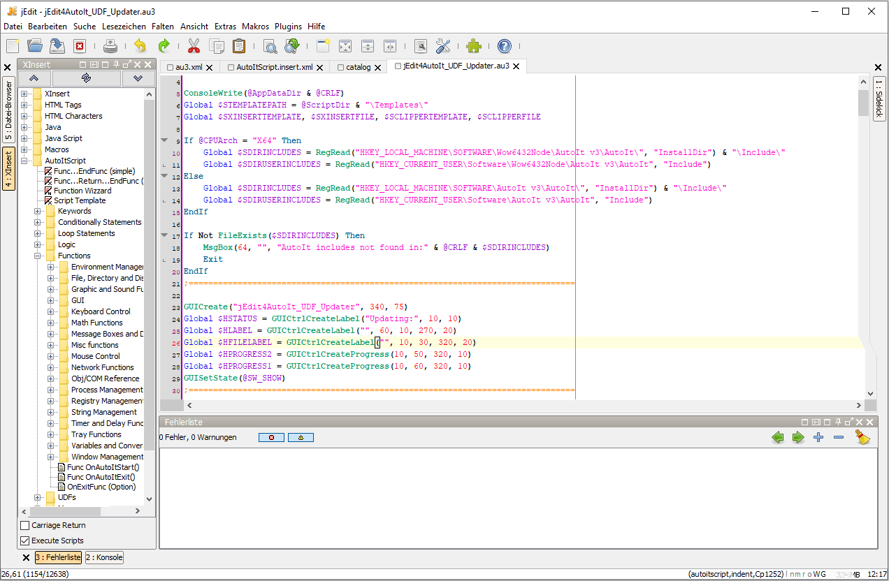

# jEdit4AutoIt

In Arbeit ...

Bis dahin auch bitte [jEdit4AutoIt](http://jedit4autoit.thorsten-willert.de/) beachten.

## Übersicht
Erweitert [jEdit](http://www.jedit.org/) zu einer IDE für [AutoIt](http://www.autoitscript.com).

### Beinhaltet:

- Edit-mode
- Commando files
- XInsert library
- Clipper libraries
- ctags
- Macros

Für weitere Informationen [hier im Wiki weiterlesen ...](https://github.com/THWillert/jEdit4AutoIt/wiki)

## Diskussion / Vorschläge

## ToDo
- [X] Dateien vervollständigen
- [ ] Commando-Dateien überarbeiten
- [ ] Präprozessor-Script durch Freemarker und FMPP ersetzen
- [ ] Wiki vervollständigen
- [ ] Wiki und Readme nach Englisch übersetzen

## Author
Thorsten Willert

[Homepage](http://www.thorsten-willert.de/)

## Lizenz
Das Ganze steht unter der [GNU 3.0](https://github.com/THWillert/jEdit4AutoIt/blob/master/LICENSE) Lizenz.
.
